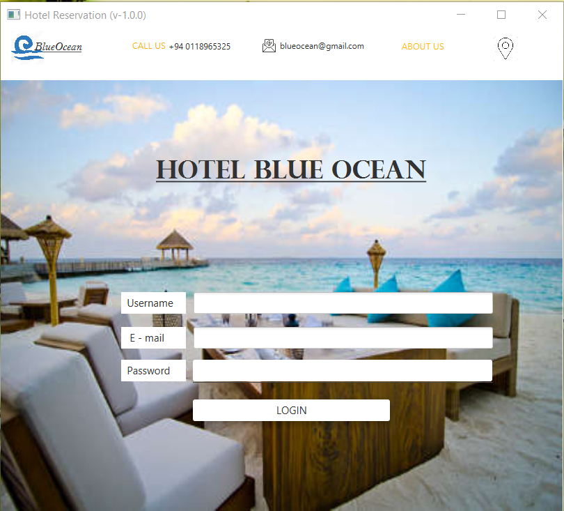

# *About* ❓
**This is my JavaFx First Project**.

<h3 align="center"></h3>

# *Introduction* 📝
Blue Ocean Hotel is a newly established hotel. This hotel is a medium-sized hotel with 25 rooms in
total. This hotel includes single, double, triple and quad rooms. Additionally, they offer three meal
plans, including local meals, Chinese meals and French meals. These meal plans can be requested
while making room reservations. This hotel requires a Room Reservation System customized to the
business process.

Blue Ocean Hotel wants to do that process quickly by software application. Therefore this project is the standalone application design created to demonstrate this process.

# *Role* ✒
* Admin
* Receptionist

# *System Requirements* 📞
1. A customer can come to the hotel in person or contact the front desk over the phone for a
reservation.
2. Once the customer inquires about rooms and packages, the receptionist provides them with
the relevant details by referring to the system.
3. Once the customers make their pick, the receptionist will check the availability of the rooms
and inform them. If the requested type is not available, the receptionist should find other
suitable types and suggest them to the customer from the information in the system.
5. Once the reservation is made, the system will print a token for the customer. The receptionist
will email the receipt to the customer later on(if the customer contacts through phone). If it’s
a walk-in customer, the receptionist will print the token for the customer.
6. If the customer makes a reservation for a night, the hotel room should be emptied by 11.00
am the next day.
7. If the customer books a room for a day or longer period, they should move out of the room
by 9.00 am on the day after the requested period.
8. Cleaners of the room will take one hour to clean a room after a customer moves out, so the
rooms will not be available for reservation until the cleaning ends.
9. Additionally, the receptionist will be informed if a particular room is under maintenance. Thus,
the receptionist marks that room under maintenance, and it will not be displayed in the
“available rooms” view.
10. The receptionist can cancel a specific reservation if the customer requests it.
11. The receptionist can view the details of the customers if necessary.
12. The hotel manager has access to the admin account, and he/she can add rooms, meal plans
and, if necessary, edit them.
13. The manager also can edit the prices of the given packages.
14. The manager gets an income report to be viewed freely according to the records in the system.
       
# *Details* 🔖
Below you can see the languages,frameworks architectures, tools I used  the project.

## Architectures
* MVC 

## Language
* Java

## technology

* JavaFX

## Tools
* IntelliJ IDEA
* Scene Builder
* Figma
